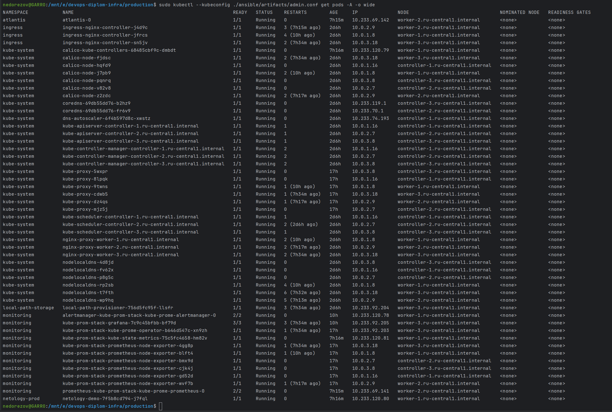
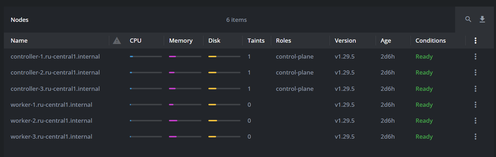

# Дипломный практикум в Yandex Cloud
## Студент: Александр Недорезов (fops-5)

* [Задание](#задание)
  * [Цели](#цели)
  * [Что необходимо для сдачи задания](#что-необходимо-для-сдачи-задания)
* [Краткие итоги](#краткие-итоги)
* [Этапы выполнения](#этапы-выполнения)
   * [1. Создание облачной инфраструктуры](#1-создание-облачной-инфраструктуры)
   * [2. Создание Kubernetes кластера](#2-создание-kubernetes-кластера)
   * [3. Создание тестового приложения](#3-создание-тестового-приложения)
   * [4. Подготовка системы мониторинга и деплой приложения](#4-подготовка-системы-мониторинга-и-деплой-приложения)
   * [5. Установка и настройка CI/CD](#5-установка-и-настройка-cicd)

---

## Задание

[*Ссылка на дипломное задание*](https://github.com/netology-code/devops-diplom-yandexcloud)

### Цели:
1. Подготовить облачную инфраструктуру на базе облачного провайдера Яндекс.Облако.
2. Запустить и сконфигурировать Kubernetes кластер.
3. Установить и настроить систему мониторинга.
4. Настроить и автоматизировать сборку тестового приложения с использованием Docker-контейнеров.
5. Настроить CI для автоматической сборки и тестирования.
6. Настроить CD для автоматического развёртывания приложения.

### Что необходимо для сдачи задания:
1. Репозиторий с конфигурационными файлами Terraform и готовность продемонстрировать создание всех ресурсов с нуля.
2. Пример pull request с комментариями созданными atlantis'ом или снимки экрана из Terraform Cloud или вашего CI-CD-terraform pipeline.
3. Репозиторий с конфигурацией ansible, если был выбран способ создания Kubernetes кластера при помощи ansible.
4. Репозиторий с Dockerfile тестового приложения и ссылка на собранный docker image.
5. Репозиторий с конфигурацией Kubernetes кластера.
6. Ссылка на тестовое приложение и веб интерфейс Grafana с данными доступа.
7. Все репозитории рекомендуется хранить на одном ресурсе (github, gitlab)

---

## Краткие итоги

1. Репозиторий с конфигурационными файлами Terraform: [smutosey/devops-diplom-infra](https://github.com/smutosey/devops-diplom-infra)  
   - Prepare - предварительная подготовка облака, выполняется вручную. Создает terraform remote s3 backend и service account с ограниченными правами.
   - Production - инфраструктура для дипломного задания, создается автоматически через GitHub Actions. Создает инфраструктуру, кластер k8s через Kubespray и через helm деплоит kube-prometheus-stack
2. Создание инфраструктуры и кластера с 0: [ссылка](https://github.com/smutosey/devops-diplom-infra/actions/runs/10098033490)  
   Latest run с изменениями кластера: [ссылка](https://github.com/smutosey/devops-diplom-infra/actions/runs/10123691536)
3. Репозиторий с тестовым приложением: [smutosey/devops-diplom-app](https://github.com/smutosey/devops-diplom-app)  
   - [Dockerfile](https://github.com/smutosey/devops-diplom-app/blob/main/smutosey.ru/Dockerfile)
   - Конструктор сайта - Hugo
   - Сборка и деплой - Werf + GitHub Actions
4. Ссылки на сервисы: 
   - https://app.smutosey.ru/ - развернутое тестовое приложение
   - https://grafana.smutosey.ru - веб-интерфейс Grafana
   - https://prometheus.smutosey.ru - веб-интерфейс Prometheus
   - https://alertmanager.smutosey.ru - веб-интерфейс Alertmanager
   - https://atlantis.smutosey.ru - веб-интерфейс Atlantis (был настроен, но не используется по назначению, legacy)

---

## Этапы выполнения

### 1. Создание облачной инфраструктуры

> 

> 
Задачи этапа:

> 
> Для начала необходимо подготовить облачную инфраструктуру в ЯО при помощи [Terraform](https://www.terraform.io/).
> 
> Особенности выполнения:
> 
> - Бюджет купона ограничен, что следует иметь в виду при проектировании инфраструктуры и использовании ресурсов;
> Для облачного k8s используйте региональный мастер(неотказоустойчивый). Для self-hosted k8s минимизируйте ресурсы ВМ и долю ЦПУ. В обоих вариантах используйте прерываемые ВМ для worker nodes.
> 
> Предварительная подготовка к установке и запуску Kubernetes кластера.
> 
> 1. Создайте сервисный аккаунт, который будет в дальнейшем использоваться Terraform для работы с инфраструктурой с необходимыми и достаточными правами. Не стоит использовать права суперпользователя
> 2. Подготовьте [backend](https://www.terraform.io/docs/language/settings/backends/index.html) для Terraform:  
>    а. Рекомендуемый вариант: S3 bucket в созданном ЯО аккаунте(создание бакета через TF)
>    б. Альтернативный вариант:  [Terraform Cloud](https://app.terraform.io/)  
> 3. Создайте VPC с подсетями в разных зонах доступности.
> 4. Убедитесь, что теперь вы можете выполнить команды `terraform destroy` и `terraform apply` без дополнительных ручных действий.
> 5. В случае использования [Terraform Cloud](https://app.terraform.io/) в качестве [backend](https://www.terraform.io/docs/language/settings/backends/index.html) убедитесь, что применение изменений успешно проходит, используя web-интерфейс Terraform cloud.
> 
> 
  
> 
> Ожидаемые результаты:
> 
> 1. Terraform сконфигурирован и создание инфраструктуры посредством Terraform возможно без дополнительных ручных действий.
> 2. Полученная конфигурация инфраструктуры является предварительной, поэтому в ходе дальнейшего выполнения задания возможны изменения.

#### Выполнение:

Репозиторий с конфигурацией: [smutosey/devops-diplom-infra](https://github.com/smutosey/devops-diplom-infra)

1. Написана конфигурация Terraform для подготовки к созданию инфраструктуры (prepare).   
   На этом этапе создаем s3 Object Storage, bucket, и обеспечиваем блокировку состояний Terraform через таблицу dynamodb.  
   Также создаем сервисный аккаунт `terraform-sa` с только необходимыми правами, перечень можно найти в [prepare/public.auto.tfvars](https://github.com/smutosey/devops-diplom-infra/blob/main/prepare/public.auto.tfvars)  
   Этап выполняется вручную, через terraform apply локально. В результате получаем ключи для подключения, которые затем переводим в base64 и складываем в секреты GitHub для следующих этапов.  
     
   
2. Написана конфигурация Terraform для создания основной инфраструктуры (production).  
   Создается автоматически через GitHub Actions. Джобы в workflow:
   - infra - создание инфрастуктуры через Terraform, state храним в s3 remote backend 
   - k8s-cluster - создание кластера k8s
   - Кластер k8s создается в этом же workflow через kubespray. Здесь же деплоится система мониторинга (kube-prometheus-stack) и atlantis через helm (по назначению не используется).  
   
   Пример Job-а с полным созданием инфраструктуры: https://github.com/smutosey/devops-diplom-infra/actions/runs/10098033490/job/27941660024
   Также есть первый вариант создания инфрастуктуры и k8s-кластера вручную, без CI/CD, [в отдельной ветке репозитория](https://github.com/smutosey/devops-diplom-infra/tree/manual)
   
Подробнее про инфраструктуру.  
1. VPC с подсетями для нод k8s в разных зонах доступности, а также отдельная public-подсеть.
2. 3 control-ноды, 3 worker-ноды, и 1 NAT-инстанс, который также является джампером для доступа по 22 порту. Т.е. все ноды кластера K8S не будут иметь публичного IP для безопасности.
3. Network load balancer - для балансировки доступа к control-plane нодам кластера.
4. Application load balancer - для роутинга по доменам, доступ к приложениям в кластере, а также терминация TLS-соединения с ранее выпущенным сертификатом.
5. Создание DNS-записей в зоне доступности.
6. Группы безопасности и правила ingress/egress.
7. Container Registry и репозиторий в нём для тестового приложения.
8. Все параметры инфраструктуры регулируются через переменные и секреты.
9. В результате генерируем `inventory.yaml` для дальнейшего запуска Kubespray.

Карта сети:  

Созданные ресурсы в Yandex Cloud:  

Схема взаимодействия:  

Схема Application Load Balancer:  

Схема Network Load Balancer:  

Создание инфраструктуры и кластера с 0: [ссылка](https://github.com/smutosey/devops-diplom-infra/actions/runs/10098033490)  
Latest run с изменениями кластера: [ссылка](https://github.com/smutosey/devops-diplom-infra/actions/runs/10123691536)

---

### 2. Создание Kubernetes кластера

> 

> 
Задачи этапа:

> 
> На этом этапе необходимо создать [Kubernetes](https://kubernetes.io/ru/docs/concepts/overview/what-is-kubernetes/) кластер на базе предварительно созданной инфраструктуры. Требуется обеспечить доступ к ресурсам из Интернета.
> 
> Это можно сделать двумя способами:
> 
> 1. Рекомендуемый вариант: самостоятельная установка Kubernetes кластера.  
> а. При помощи Terraform подготовить как минимум 3 виртуальных машины Compute Cloud для создания Kubernetes-кластера. Тип виртуальной машины следует выбрать самостоятельно с учётом требований к производительности и стоимости. Если в дальнейшем поймете, что необходимо сменить тип инстанса, используйте Terraform для внесения изменений.  
> б. Подготовить [ansible](https://www.ansible.com/) конфигурации, можно воспользоваться, например [Kubespray](https://kubernetes.io/docs/setup/production-environment/tools/kubespray/)  
> в. Задеплоить Kubernetes на подготовленные ранее инстансы, в случае нехватки каких-либо ресурсов вы всегда можете создать их при помощи Terraform.
> 2. Альтернативный вариант: воспользуйтесь сервисом [Yandex Managed Service for Kubernetes](https://cloud.yandex.ru/services/managed-kubernetes)  
> а. С помощью terraform resource для [kubernetes](https://registry.terraform.io/providers/yandex-cloud/yandex/latest/docs/resources/kubernetes_cluster) создать **региональный** мастер kubernetes с размещением нод в разных 3 подсетях      
> б. С помощью terraform resource для [kubernetes node group](https://registry.terraform.io/providers/yandex-cloud/yandex/latest/docs/resources/kubernetes_node_group)
> 
> 
> 
  
> 
> Ожидаемый результат:
> 
> 1. Работоспособный Kubernetes кластер.
> 2. В файле `~/.kube/config` находятся данные для доступа к кластеру.
> 3. Команда `kubectl get pods --all-namespaces` отрабатывает без ошибок.

#### Выполнение:

Установка выполняется с помощью Kubespray. Изначально, когда разворачивание было вручную, запуск kubespray был через terraform одним из ресурсов `terraform_data` c `local-exec`-провайдером.  
После реализации GitHub Actions это происходит в отдельной джобе `k8s-cluster` в стандартном workflow.
`inventory` генерируется на предыдущем этапе при создании инфраструктуры. Шаблон: [production/templates/inventory.yml.tftpl](https://github.com/smutosey/devops-diplom-infra/blob/main/production/templates/inventory.yml.tftpl)

Параметры для kubespray: [production/ansible/group_vars](https://github.com/smutosey/devops-diplom-infra/tree/main/production/ansible/group_vars)

Пример создания кластера: [run](https://github.com/smutosey/devops-diplom-infra/actions/runs/10098033490/job/27941830848)

Выполнение `kubectl --kubeconfig ./ansible/artifacts/admin.conf get pods -A -o wide`:

Статус нод:

При автоматическом развертывании kube config нужно доставать с нод вручную, т.к. в артефакты его класть небезопасно для публичных репозиториев.
Для сборки в репозитории прописаны секреты:  

---

### 3. Создание тестового приложения

> 

> 
Задачи этапа:

> 
> Для перехода к следующему этапу необходимо подготовить тестовое приложение, эмулирующее основное приложение разрабатываемое вашей компанией.
> 
> Способ подготовки:
> 
> 1. Рекомендуемый вариант:  
> а. Создайте отдельный git репозиторий с простым nginx конфигом, который будет отдавать статические данные.  
> б. Подготовьте Dockerfile для создания образа приложения.  
> 2. Альтернативный вариант:  
> а. Используйте любой другой код, главное, чтобы был самостоятельно создан Dockerfile.
> 
> 
  
> 
> Ожидаемый результат:
> 
> 1. Git репозиторий с тестовым приложением и Dockerfile.
> 2. Регистри с собранным docker image. В качестве регистри может быть DockerHub или [Yandex Container Registry](https://cloud.yandex.ru/services/container-registry), созданный также с помощью terraform.

#### Выполнение:

Репозиторий с тестовым приложением: [smutosey/devops-diplom-app](https://github.com/smutosey/devops-diplom-app)

Представляет собой статический сайт, генерируемый при сборке через конструктор Hugo, параметры: [smutosey.ru/hugo.yaml](https://github.com/smutosey/devops-diplom-app/blob/main/smutosey.ru/hugo.yaml)  
Приложение собирается в образ, [smutosey.ru/Dockerfile](https://github.com/smutosey/devops-diplom-app/blob/main/smutosey.ru/Dockerfile) на основе nginx.  
Сборка и деплой осуществляется с помощью Werf + GitHub Actions. Собранный образ размещается в YC registry:  

---

### 4. Подготовка системы мониторинга и деплой приложения

> 

> 
Задачи этапа:

> 
> Уже должны быть готовы конфигурации для автоматического создания облачной инфраструктуры и поднятия Kubernetes кластера.  
> Теперь необходимо подготовить конфигурационные файлы для настройки нашего Kubernetes кластера.
> 
> Цель:
> 1. Задеплоить в кластер [prometheus](https://prometheus.io/), [grafana](https://grafana.com/), [alertmanager](https://github.com/prometheus/alertmanager), [экспортер](https://github.com/prometheus/node_exporter) основных метрик Kubernetes.
> 2. Задеплоить тестовое приложение, например, [nginx](https://www.nginx.com/) сервер отдающий статическую страницу.
> 
> Способ выполнения:
> 1. Воспользоваться пакетом [kube-prometheus](https://github.com/prometheus-operator/kube-prometheus), который уже включает в себя [Kubernetes оператор](https://operatorhub.io/) для [grafana](https://grafana.com/), [prometheus](https://prometheus.io/), [alertmanager](https://github.com/prometheus/alertmanager) и [node_exporter](https://github.com/prometheus/node_exporter). Альтернативный вариант - использовать набор helm чартов от [bitnami](https://github.com/bitnami/charts/tree/main/bitnami).
> 2. Если на первом этапе вы не воспользовались [Terraform Cloud](https://app.terraform.io/), то задеплойте и настройте в кластере [atlantis](https://www.runatlantis.io/) для отслеживания изменений инфраструктуры. Альтернативный вариант 3 задания: вместо Terraform Cloud или atlantis настройте на автоматический запуск и применение конфигурации terraform из вашего git-репозитория в выбранной вами CI-CD системе при любом комите в main ветку. Предоставьте скриншоты работы пайплайна из CI/CD системы.
>
> 
  
>
> Ожидаемый результат:
> 1. Git репозиторий с конфигурационными файлами для настройки Kubernetes.
> 2. Http доступ к web интерфейсу grafana.
> 3. Дашборды в grafana отображающие состояние Kubernetes кластера.
> 4. Http доступ к тестовому приложению.

#### Выполнение:

Система мониторинга разворачивается вместе с деплоем инфраструктуры, через GitHub Actions + Helm actions, в отдельном джобе.  
Используется Helm-chart `prometheus-community/kube-prometheus-stack`

Также в кластер деплоится Atlantis через Helm-chart. Изначально планировал настройку через него, но в процессе понял, что Atlantis в процессе может "сломать" сам себя, т.к. разворачивает кластер, где существует сам. Из соображений безопасности решил перенастроить на GitHub Actions - [devops-diplom-infra/workflows/infra-deploy.yml](https://github.com/smutosey/devops-diplom-infra/blob/main/.github/workflows/infra-deploy.yml). 
Workflow запускается при любом коммите в main-ветку.

Для разворачивания приложения в кластер подготовил шаблоны манифестов: [devops-diplom-app/.helm/templates](https://github.com/smutosey/devops-diplom-app/tree/main/.helm/templates).
Создается Deployment, Service и Ingress.

Пример успешного деплоя: https://github.com/smutosey/devops-diplom-infra/actions/runs/10098033490/job/27943055041

Развернутое приложение: https://app.smutosey.ru  

Веб-интерфейс Grafana: https://grafana.smutosey.ru. В ней множество необходимых дашбордов для мониторинга k8s-кластера.  

Prometheus: https://prometheus.smutosey.ru  
Alertmanager: https://alertmanager.smutosey.ru  
Atlantis: https://atlantis.smutosey.ru  

---

### 5. Установка и настройка CI/CD

> 

> 
Задачи этапа:

> 
> Осталось настроить ci/cd систему для автоматической сборки docker image и деплоя приложения при изменении кода.
> 
> Цель:
> 
> 1. Автоматическая сборка docker образа при коммите в репозиторий с тестовым приложением.
> 2. Автоматический деплой нового docker образа.
> 
> Можно использовать [teamcity](https://www.jetbrains.com/ru-ru/teamcity/), [jenkins](https://www.jenkins.io/), [GitLab CI](https://about.gitlab.com/stages-devops-lifecycle/continuous-integration/) или GitHub Actions.
>
> 
  
> 
> Ожидаемый результат:
> 
> 1. Интерфейс ci/cd сервиса доступен по http.
> 2. При любом коммите в репозиторие с тестовым приложением происходит сборка и отправка в регистр Docker образа.
> 3. При создании тега (например, v1.0.0) происходит сборка и отправка с соответствующим label в регистри, а также деплой соответствующего Docker образа в кластер Kubernetes.

#### Выполнение:

Для сборки и деплоя приложения решил использовать Werf, на основе GitHub Actions.

Создал 2 workflow:
1. [build](https://github.com/smutosey/devops-diplom-app/blob/main/.github/workflows/build.yml)
Запускается при любом коммите в любую ветку. Выполняется `werf cr` для аутентификации в Container Registry и `werf build` для сборки docker image и отправки в registry. Тег образа формируется исходя из содержимого слоев (фича werf).  

2. [deploy](https://github.com/smutosey/devops-diplom-app/blob/main/.github/workflows/deploy.yml)
Запускается при создании тега с семантическим версионированием (`v[0-9]+.[0-9]+.[0-9]+`). В джобе также выполняем `werf cr` и запускаем после `werf converge`, который собирает образ, пушит в registry и выполняет деплой в k8s-кластер. 

Конфигурация для доступа в кластер лежит в секретах репозитория:  

Запуски workflow можно посмотреть здесь: https://github.com/smutosey/devops-diplom-app/actions

---

   

